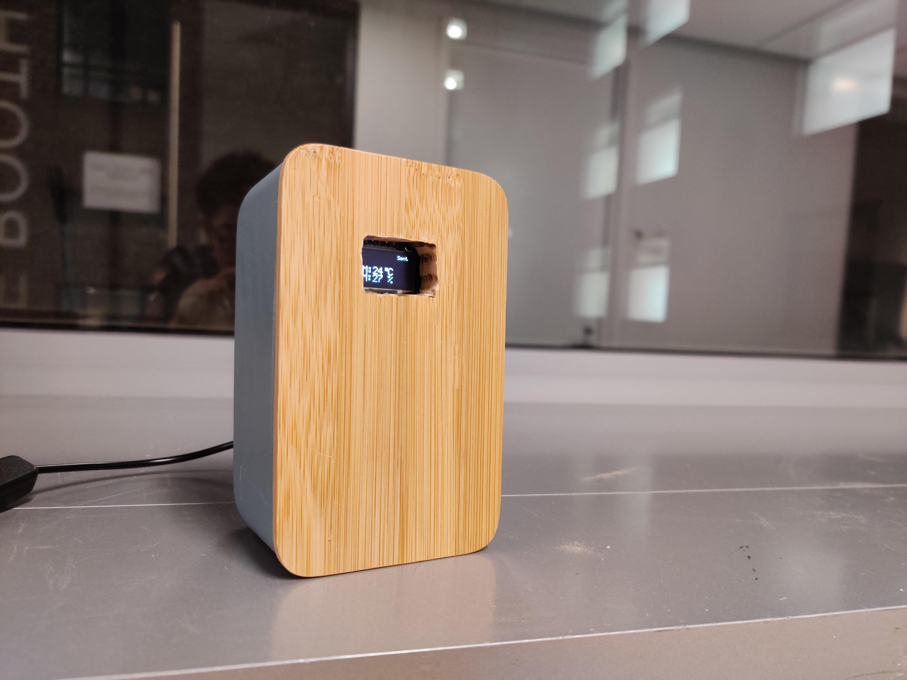

# Environmental Monitor (Raspberry Pi Zero W)

Documentation on [Wordpress](https://jason1996429.wordpress.com/2020/03/09/connected-devices-final-environmental-monitor/)

## Intro

The final assignment is to create a environmental monitor that is connected to internet and send data to a serve/database.